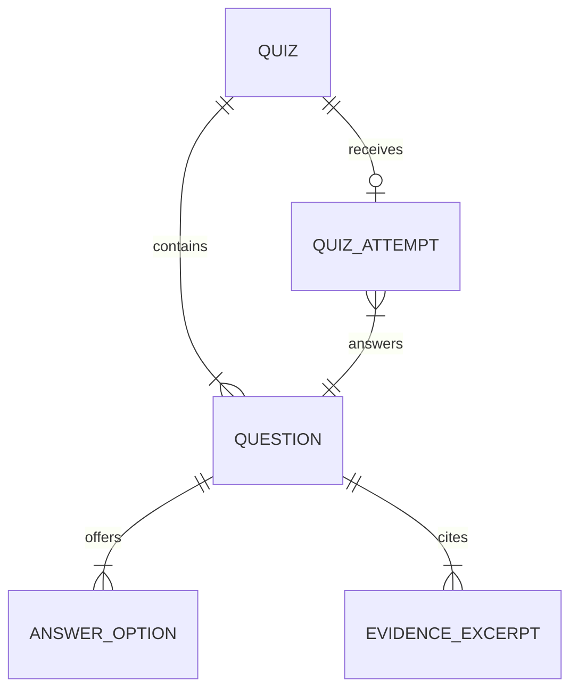

# Data Model: Text Quiz Generator

## Ownership Boundary

The browser owns only presentation state and selected answers before submission.
The API owns source text, generated questions, correct answers, explanations,
evidence, scoring, expiration, and provider metadata. This keeps answer keys and
AI credentials outside the client.

## Entities

### Source Input

Represents what the learner supplies to start a quiz.

| Field | Type | Rules |
| --- | --- | --- |
| `topicContext` | String, optional | Maximum 160 characters. It labels the quiz but cannot introduce facts not in the source text. |
| `sourceText` | String | 100 to 20,000 non-whitespace characters after normalization. |
| `difficulty` | Enum | One of `easy`, `medium`, or `hard`. |

### Quiz

Represents one server-side generated quiz.

| Field | Type | Rules |
| --- | --- | --- |
| `id` | UUID | Opaque, high-entropy identifier returned to the browser. |
| `topicContext` | String, optional | Copied from Source Input. |
| `sourceText` | String | Server-only source material; never included in logs. |
| `difficulty` | Difficulty | Immutable for the quiz. |
| `questions` | List of Question | Exactly 10 items in order 1 through 10. |
| `status` | Quiz Status | `ready`, `submitted`, `superseded`, or `expired`. |
| `createdAt` | Timestamp | Recorded when generation succeeds. |
| `expiresAt` | Timestamp | Set to 60 minutes after creation or regeneration. |
| `providerMetadata` | Internal metadata | Model identifier, duration, and trace ID; no credential or raw provider payload. |

### Question

Represents a single multiple-choice question.

| Field | Type | Rules |
| --- | --- | --- |
| `id` | UUID | Unique inside the quiz. |
| `number` | Integer | Unique value from 1 through 10. |
| `prompt` | String | Must be answerable from the source evidence. |
| `options` | List of Answer Option | Exactly 4 items labeled A, B, C, and D. |
| `correctOption` | Option Label | Exactly one of A through D; server-only until results. |
| `explanations` | Map of Option Label to String | Contains one non-empty explanation for every option; server-only until results. |
| `evidence` | List of Evidence Excerpt | At least one excerpt that matches the source text exactly. |

### Answer Option

Represents a learner-selectable answer.

| Field | Type | Rules |
| --- | --- | --- |
| `label` | Option Label | One of A, B, C, or D; unique per question. |
| `text` | String | Non-empty and distinct from other option text in the same question. |

### Evidence Excerpt

Represents a traceable basis for a question and its feedback.

| Field | Type | Rules |
| --- | --- | --- |
| `quote` | String | Non-empty verbatim excerpt from the normalized source text. |
| `sourceStart` | Integer | Zero-based position of the excerpt in normalized source text. |
| `sourceEnd` | Integer | Exclusive end position, greater than `sourceStart`. |

### Quiz Attempt

Represents the learner's answer state and evaluated result for one quiz.

| Field | Type | Rules |
| --- | --- | --- |
| `quizId` | UUID | References one non-expired quiz. |
| `answers` | Map of Question ID to Option Label | Contains exactly one answer for each of the 10 question IDs at submission. |
| `score` | Integer, nullable | Server-calculated value from 0 through 10; null before submission. |
| `submittedAt` | Timestamp, nullable | Set only after a complete submission is evaluated. |

## Relationships

## State Transitions

| Current State | Event | Next State | Rule |
| --- | --- | --- | --- |
| No quiz | Valid generation request succeeds | `ready` | Server stores a validated 10-question quiz. |
| `ready` | Complete submission succeeds | `submitted` | Server scores all 10 answers and reveals results. |
| `ready` or `submitted` | Regeneration succeeds | `superseded` | Original quiz is no longer active; a new `ready` quiz uses the same source and difficulty. |
| `ready` or `submitted` | 60-minute cache lifetime ends | `expired` | Subsequent submit or regenerate calls return an expiration error. |
| Any active state | Provider or validation failure | Unchanged | No partial quiz is stored; the browser retains source input for retry. |

## Validation Rules

- Normalize line endings and trim only for validation; retain the user's content
  for display.
- Reject input with fewer than 100 non-whitespace characters or more than
  20,000 non-whitespace characters.
- Reject a provider candidate unless it has 10 questions, ordered 1 through 10,
  with four unique A-D options, one correct option, four explanations, and at
  least one matching evidence excerpt per question.
- Reject duplicate question prompts and duplicate option text within a question.
- Reject a submission that omits a question, repeats a question, refers to an
  unknown question, or uses an option outside A-D.
- Treat cached answer keys as authoritative; do not accept a client score,
  correct answer, explanation, or evidence as input.

## Data Retention and Privacy

- Cache source text and quiz state only for the active 60-minute session.
- Do not write raw source text, answer text, explanations, or API credentials to
  application logs.
- Store diagnostics as trace ID, event type, duration, validation result, and
  provider status only.
- Replace local in-memory cache with a protected distributed cache before
  deploying more than one API instance.
